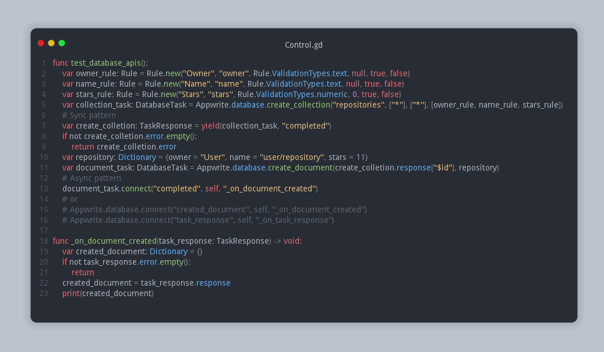

# Godot Engine - Appwrite SDK (client+server)
A lightweight addon which integrates Appwrite APIs for Godot Engine out of the box.  

- [X] Account (client/server)
- [ ] Users 
- - [ ] client
- - [ ] server
- [ ] Teams 
- - [ ] client
- - [ ] server
- [X] Database (client/server)
- [X] Storage  (client/server)
- [ ] Functions 
- - [ ] client
- - [ ] server
- [ ] Localization 
- - [ ] client
- - [ ] server
- [ ] Avatars 
- - [ ] client
- - [ ] server
- [X] Health (server)
- [ ] Realtime 
- - [ ] client
- - [ ] server

